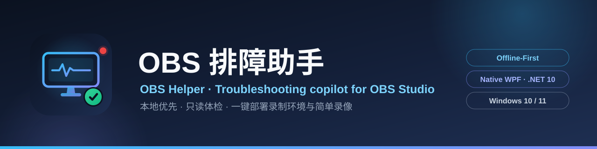

<div align="center">



# OBS Helper · OBS 排障助手

**The offline-first troubleshooting companion for [OBS Studio](https://obsproject.com/) — built for streamers who are just getting started.**

[](https://github.com/YYRMMAYO/OBS_Helper/actions/workflows/ci.yml)
[]()
[]()
[]()
[](https://github.com/YYRMMAYO/OBS_Helper/releases)
[](https://github.com/obsproject/obs-studio/releases)
[]()
[](LICENSE)

**English** · [简体中文](README.md)

</div>

> **What is it?** OBS Helper is a native **Windows (WPF)** desktop app that helps you get unstuck with OBS Studio — find a fix for that weird stutter, analyze your OBS logs, or control scenes, recording and streaming right from a hotkey or a tiny always-on-top window. The entire knowledge base, troubleshooting guide and log-analysis rules are **embedded in the app**: everything works with **zero internet connection**.
>
> This is the **native WPF rewrite** of the original Blazor + WebView2 version (source lives in [`NOBS/`](NOBS/)). The browser engine is gone, startup is instant, and it ships as a single self-contained folder.
>
> **Since V2.2 there's a built-in plugin directory**: 57 curated plugins with direct GitHub Releases downloads, a read-only scan of locally installed plugins (with multi-drive OBS install detection), and log-analysis links that jump straight to the suspect plugin. **Since V2.1, updates are incremental and knowledge bases update independently**: only changed files are downloaded, and both the issue database and the plugin catalog can be upgraded without waiting for a new release.
>
> **V2.9 adds a first-run tutorial**, re-audits the whole plugin catalog (every entry re-verified against its repository: not archived, recently maintained, Windows build available — abandoned entries dropped, maintenance status shown on each card), and aligns the app with **OBS Studio 32.2.2**: log parsing, config keys, the obs-websocket handshake and the local plugin scan (including the new `%ProgramData%\obs-studio\plugins\<name>\bin\64bit` layout introduced in OBS 32.x) were all verified against a real 32.2.2 installation. See [RELEASE_NOTES_v2.9.0.md](NOBS/RELEASE_NOTES_v2.9.0.md) (Chinese) for the full changelog of V2.4 → V2.9.

---

## Highlights

| | |
|---|---|
| **149 fixes, fully offline** | A built-in knowledge base of **149 curated issues across 10+ categories** (v2.0) — symptoms, root causes, step-by-step fixes, tips and related questions. Steps are checkable and your progress is remembered. The **knowledge base updates independently** from the app. |
| **First-run tutorial (V2.9)** | A four-step overlay on first launch — connect to OBS → where to look when something breaks → one-click health check → go live & decorate. Every entry it mentions uses the real navigation label, and you can replay it any time from *Settings → Onboarding* without restarting. |
| **Plugin square + local plugin health check** | **57 curated plugins** across 8 categories, fully re-audited in V2.9 (repository not archived, recently maintained, Windows build available) with a **maintenance status** shown on each card; a **read-only scan** of locally installed plugins locates the OBS install directory across all drives — registry (multi-view + HKCU + DisplayIcon fallback), per-drive standard layouts, Steam libraries and the OBS 32.x per-plugin roots (`%ProgramData%\obs-studio\plugins\<name>\bin\64bit`) — so non-C-drive and new-style installs are never missed. Log analysis can link a suspect module straight to its plugin card. |
| **Incremental updates** | Since V2.1 the in-app "incremental update" downloads only changed files (the 2.2 → 2.3.0 delta is about **1.3 MB**); every file is SHA-256 verified, with automatic fallback to the full installer; installed versions auto-elevate, swap files and restart. |
| **Auto-cleanup of installers** | On startup the app scans temp / Downloads / Desktop folders and deletes old OBS_Helper installers & delta packages (newest kept per kind), only ever touching `OBS_Helper_*` files. |
| **Free AI diagnostics, zero setup** | No API key, no sign-up, no configuration. Two built-in free channels (Zhipu for mainland China, Pollinations worldwide), rate-limited **locally** to protect the free service, with automatic fallback to the offline engine. |
| **Remote-control your OBS** | Switch scenes, toggle sources, mute audio, start/stop recording, streaming and the virtual camera, schedule stops, and open your recording folder — from the console page, the system tray, a global hotkey, or a mini always-on-top window. |
| **Hotkeys for everything** | `Ctrl+Alt+R` record · `Ctrl+Alt+S` stream · `Ctrl+Alt+C` virtual camera · `Ctrl+Alt+M` mini window · `Ctrl+Alt+O` show/hide — every key is rebindable or can be disabled. |
| **Deep log analysis** | Offline parsing of OBS logs with **39 rules + 3 quantitative ratios**, tuned against **real OBS 32.2.2 logs** — and logs are **sanitized** before anything leaves your machine. Dropped-frame / crash clues can be linked to a suspect plugin and jumped straight to its card. |
| **One-click scene templates** | 6 built-in stream presets (gaming, vertical shopping, duo talk, teaching, radio standby, go-live trio) that deploy scenes, sources and transitions into OBS in a single click. Templates annotate recommended plugins and flag missing ones against the local scan. |
| **Privacy-first** | Preferences are plain JSON with no credentials; passwords & API keys get **double encryption** (AES-256-GCM + DPAPI). Nothing is sent anywhere unless you explicitly trigger a diagnostic. |
| **Zero third-party dependencies** | Native WPF on .NET 10, no NuGet packages, no WebView2 — the `obs-websocket` protocol is implemented by hand. One self-contained folder, instant startup. |

## Features

### Learn & troubleshoot

- **First-run tutorial** — a four-step walkthrough on first launch (connect to OBS → where to look when something breaks → one-click health check → go live & decorate); replay it from *Settings → Onboarding*
- **Knowledge base** — 10+ categories, 149 issues (v2.0), each with symptoms / root causes / step-by-step fixes / tips / related questions; steps are checkable and progress is remembered
- **Independent knowledge-base updates** — issue database and plugin catalog are decoupled from the app version: silent auto-update at startup (6h throttled), a "Check KB updates" button in Settings, and an "Update knowledge base only" option in the update dialog; GitHub raw primary channel + Release asset fallback
- **Instant search** — matches across titles, symptoms and causes as you type
- **Ask me anything** — describe the problem in plain words and get the most likely issue
- **Troubleshooting guide** — a quick-reference manual of general debugging approaches

### Plugin square

- **Curated plugin directory** — 8 categories × 57 curated plugins (automation / visual FX / AI / audio / multi-platform & vertical / recording / input), externally hot-updatable: link fixes and new entries ship without a new release. The v1.4 catalog was re-audited end to end (not archived + recently maintained + a Windows build exists) and each card shows its maintenance status
- **Local plugin health check (read-only)** — scans installed DLLs & versions and marks "catalogued / uncatalogued"; the OBS install directory is located via multiple signals — running process, registry uninstall keys (HKLM dual view + HKCU, DisplayIcon fallback), standard layouts on every fixed drive, and Steam library folders — plus portable installs, per-user plugin folders, the OBS 32.x global plugin root (`%ProgramData%\obs-studio\plugins`, per-plugin `bin\64bit` layout) and a manually specified directory
- **Direct downloads** — every card links to the latest GitHub Releases with a "latest vX.Y.Z" badge; "watch" a plugin for silent startup checks (Toast only)
- **Log × plugin correlation** — log analysis extracts failed/crashing modules and links them to catalog cards; AI plugins carry public cost estimates with live performance-budget hints

### Diagnose

- **Smart diagnostics** — one-click health check once connected to OBS; pick from three engines (see [Smart Diagnostics](#smart-diagnostics)); results can be **exported as a Markdown report**
- **Log analysis** — offline OBS log parser: 39 rules + 3 quantitative ratios, with logs sanitized before analysis

### Control OBS

- **OBS console** — scene switching, source visibility, audio mute & volume, record / stream / virtual camera, live stats, **scheduled stop**, **one-click open recording folder**
- **System tray + notifications** — minimize to tray on close; start/stop recording, streaming and the virtual camera right from the tray menu
- **Mini window** — a draggable, always-on-top panel with one-click record / stream / virtual camera; remembers its position; summon it from the tray, the console or a hotkey
- **Global hotkeys** — system-wide shortcuts (`Ctrl+Alt+R/S/C/M/O` by default), all rebindable or disable-able in Settings
- **Auto scene switching** — switch scenes based on the foreground window title, with keyword or regex rules managed in Settings

### Stay healthy & set up fast

- **System monitor** — live CPU / memory / network / disk curves (last 2 minutes), linked with OBS render FPS and dropped-frame data; warns when disk space runs low
- **Scene templates** — 6 built-in presets deployed in one click (scenes + sources + transitions), or exported as a standard scene-collection JSON
- **OBS config management** — config directory detection, backup / export (ZIP, sanitized by default), import (overwrite or merge, with automatic backup), light reset and full factory reset
- **Streaming setup** — a 6-step walkthrough from zero to live, plus streaming presets for 10 major platforms
- **Appearance** — light / dark / follow system, 4 font sizes, high-contrast and reduced-motion options

## Smart Diagnostics

Connect to OBS and run a one-click health check. Three engines are available:

| Engine | How it works | Cost |
| --- | --- | --- |
| **Local rules engine** (default) | Deterministic offline rule matching — the same engine that powers log analysis | Free, fully offline |
| **Free AI (built-in)** | Two channels — **Zhipu free model** (most reliable in mainland China; key embedded at build time) and **Pollinations** (key-free, worldwide). Locally rate-limited: **10 diagnostics/day** on Zhipu, **20/day** on Pollinations, counters independent, reset at midnight | Free, no sign-up |
| **Cloud LLM** | OpenAI-compatible API + function calling against your own key, stored with double encryption | Your API cost |

Cloud/free failures **automatically fall back to the local engine**, and the report tells you why. The free tier is a single-turn conversation without knowledge-base tool calls; for deep multi-turn troubleshooting, plug in your own cloud key.

## Privacy & Security

All data stays on your machine:

- **Preferences** (appearance, bookmarks, step progress, connection settings, hotkeys, auto-switch rules, tray behavior) → `%LocalAppData%\OBS_Helper\prefs.json` — plain JSON, **no credentials**.
- **OBS passwords & AI API keys** → `%LocalAppData%\OBS_Helper\secrets.dat` — **double encryption**: each value is AES-256-GCM encrypted with a key derived from the machine's `MachineGuid` via PBKDF2-SHA256, and the whole file is then DPAPI-encrypted (bound to the current Windows user + app entropy). It cannot be decrypted on another machine or user, even if the file is stolen offline.

The app only goes online when you **explicitly** enable the free-AI or cloud diagnostic engine and run a diagnostic — and logs are sanitized before any request is sent. OBS config backups exclude stream keys by default (opt-in to include them); passwords and tokens are automatically redacted.

## Installation & Updates

- **GitHub Releases** — download the installer or portable ZIP from the [Releases page](https://github.com/YYRMMAYO/OBS_Helper/releases). The portable build needs no installation and carries its own .NET runtime.
- **Blue Lanzou (CN mirror)** — Chinese users can download from 蓝奏云 with extract code `YYKWY` (see the app's update dialog).
- **In-app updater (recommended)** — after "Check for updates" finds a newer version you can choose:
  - **Incremental update (all features)**: downloads only the changed files since the last release (usually a few MB), verifies them, auto-elevates & swaps files, then restarts
  - **Update knowledge base only**: upgrades just the issue database in seconds — no reinstall
  - **Full installer**: Lanzou or in-app download of the complete package

> Windows 10 / 11. No WebView2, no .NET runtime install, no administrator rights required.
> Users on 2.1.x – 2.8.x can jump straight to 2.9.0 via the in-app incremental update.

## Building from Source

Requires the [.NET 10 SDK](https://dotnet.microsoft.com/download); the installer additionally needs [Inno Setup 6](https://jrsoftware.org/isdl.php).

```powershell
# from the repository root
cd NOBS

# run it
dotnet run --project OBS_Helper.Wpf

# build installer + portable zip + delta package -> NOBS\PAKE\windows\ (version from the csproj <Version>)
.\build.ps1

# additionally produce a single-file exe
.\build.ps1 -SingleFile

# portable zip only (no Inno Setup installed)
.\build.ps1 -SkipInstaller

# jump-version release: pin the delta base so older users can also go incremental
.\build.ps1 -DeltaBaseVersion 2.0.0

# verify the delta package upgrades cleanly (simulated upgrade + full SHA-256 diff)
python scripts\verify_delta.py --old PAKE\windows\OBS_Helper_Portable_2.0.0.zip --delta PAKE\windows\OBS_Helper_Update_2.1.1.zip --publish OBS_Helper.Wpf\bin\Release\net10.0-windows\win-x64\publish
```

Artifacts land in `NOBS\PAKE\windows\`:

- `OBS_Helper_Setup_2.9.0.exe` — installer
- `OBS_Helper_Portable_2.9.0.zip` — unzip-and-run portable build
- `OBS_Helper_Update_2.9.0.zip` — incremental update package (contains `update_manifest.json`, used by the in-app updater)
- `OBS_Helper_Portable_2.9.0.exe` — single-file build (with `-SingleFile`)
- `OBS_Helper_Plugins_1.4.json` — plugin directory v1.4 (independent hot-update asset, published with the release)
- `OBS_Helper_Knowledge_2.2.json` — issue database v2.2 (independent hot-update asset, published with the release)
- `manifests/manifest_<ver>.json` — per-version file manifest (SHA-256, delta diff base; not published as a release asset)

## Project Structure

```
NOBS/
  OBS_Helper.Wpf/
    App.xaml(.cs)          App entry, global exception -> error-code dialog
    MainWindow.xaml(.cs)   Left nav + top bar + page host + first-run tutorial overlay, route registration
    AppServices.cs         Composition root: lazy singletons, manual wiring
    Navigation/            Minimal router (route name -> page factory, cache + back stack)
    Views/                 18 pages / windows
    Controls/              Shared controls & value converters
    Themes/                Palette.xaml + Controls.xaml style library
    Models/                knowledge base, obs-websocket protocol, OBS config models
    Services/
      Host/                HostBridge (DPAPI, log reading, AI relay), LocalStore
      Obs/                 WebSocket client, connection service, log analysis, sanitizer
      ObsConfig/           OBS config discovery (multi-signal install detection across drives), backup/export/import, reset, scene-template deploy
      Plugins/             plugin square: catalog / local health-check scanner / release checks / watch service
      Update/              incremental update (manifest / self-bootstrap), independent KB updates, installer auto-cleanup
      Ai/                  local / free / cloud diagnostic engines & orchestration (incl. free-tier rate limiter)
      Shell/               tray, global hotkeys, auto scene switcher, timers, system monitor, record watchdog, live log tail, tutorial & OBS log-file finder (pure logic)
      Markdown/            troubleshooting guide markdown parser
    Assets/                problems.json / plugins.json (embedded seeds, overridable by external files at runtime), troubleshooting.md, scene_templates.json, icons
  build.ps1                Windows build & packaging script (installer / portable / delta / manifest)
  scripts/verify_delta.py  delta-package release verifier (simulated upgrade + full SHA-256 diff)
```

Theming works by writing the palette into `Application.Resources`; all XAML references it via `DynamicResource`, so theme switches take effect across the whole window instantly.

### Repository layout

| Path | Description |
| --- | --- |
| `NOBS/` | **Current, maintained Windows native WPF version** (what this document is about) |
| `OBS_Helper.Client/` | Old shared frontend (Blazor WASM) — archived |
| `OBS_Helper.Win/` | Old Windows desktop shell (WebView2) — archived |
| `OBS_Helper.Mac/` | macOS desktop shell (Tauri v2) — archived |
| `docs/` | Old-version architecture / error codes / dependency docs — archived |

## License

[MIT](LICENSE)
