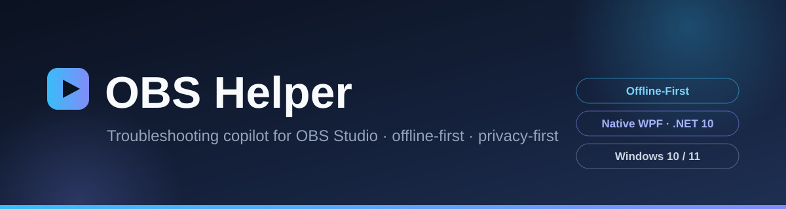

<div align="center">



# OBS 排障助手 · OBS Helper

**面向直播新手的 OBS Studio 排障工具 —— 纯离线 · 隐私优先 · 原生 WPF**

[](https://github.com/YYRMMAYO/OBS_Helper/actions/workflows/ci.yml)
[]()
[]()
[]()
[](https://github.com/YYRMMAYO/OBS_Helper/releases)
[]()
[](LICENSE)

[English](README.en.md) · **简体中文**

</div>

> **这是什么？** 面向直播新手的 OBS Studio 排障工具。**纯离线可用**：95 条问题的知识库、排障指引、日志分析规则全部内嵌在程序里，不联网也能查。连上 OBS 之后还能远程控制场景、录制与推流，并做一键体检。
>
> 这是原 Blazor WebAssembly + WebView2 版本的**原生 WPF 重构**（源码在 [`NOBS/`](NOBS/)），功能一比一对齐，但去掉了浏览器内核这一层：冷启动直接起窗口、自包含单目录发布、无需安装 WebView2 与 .NET 运行时。

---

## 亮点

| | |
|---|---|
| **95 条问题库，完全离线** | 内置 **10 个分类、95 条问题**，含现象 / 成因 / 分步解决 / 小贴士 / 相关问题；步骤可勾选，进度自动记住 |
| **免费 AI 诊断，开箱即用** | 不用注册、不用 API Key。内置两条免费通道（智谱国内直连 / Pollinations 全球免 Key），**本地强制限频**保护免费服务，失败自动回退离线引擎 |
| **远程控制 OBS** | 场景切换、元素显隐、音频静音与音量、录制 / 推流 / 虚拟摄像头、定时停止、打开录制目录——控制台、托盘、全局热键、迷你小窗四种入口随时可用 |
| **全局热键** | `Ctrl+Alt+R` 录制 · `Ctrl+Alt+S` 推流 · `Ctrl+Alt+C` 虚拟摄像头 · `Ctrl+Alt+M` 小窗 · `Ctrl+Alt+O` 显隐窗口——全部可在设置里改键或停用 |
| **深度日志分析** | 离线解析 OBS 日志：**23 条规则 + 3 项量化比值**；日志在分析前**先脱敏** |
| **场景模板一键落地** | 6 套内置直播间模板（游戏 / 竖屏带货 / 双人连麦 / 教学 / 电台待机 / 开播三件套），连上 OBS 一键生成场景与来源（含过渡设置） |
| **隐私优先** | 偏好文件不含任何凭据；密码与 API Key **双层加密**（AES-256-GCM + DPAPI）。只有你主动发起诊断才会联网，请求前先脱敏 |
| **零第三方依赖** | 原生 WPF + .NET 10，无 NuGet 包、无 WebView2，`obs-websocket` 协议纯手写；自包含单目录，秒开 |

## 功能

### 学习与排查

- **知识库** — 10 个分类、95 条问题，含现象 / 成因 / 分步解决 / 小贴士 / 相关问题；步骤可勾选且进度会记住
- **搜索** — 边打边搜，跨标题、现象、成因匹配
- **问我一下** — 用大白话描述现象，自动匹配最可能的问题
- **排障指引** — 通用排查思路速查手册

### 智能诊断

- **智能诊断** — 连上 OBS 后一键体检；三种引擎可选（见下方 [智能诊断](#智能诊断)），**结果可导出为 Markdown 报告**
- **日志分析** — 离线解析 OBS 日志：23 条规则 + 3 项量化比值；分析前先脱敏

### 控制 OBS

- **OBS 控制台** — 场景切换、元素显隐、音频静音与音量、录制 / 推流 / 虚拟摄像头、实时统计、**定时停止录制/推流**、**一键打开录制目录**
- **系统托盘 + 通知** — 关闭窗口最小化到托盘，托盘菜单直接控制录制 / 推流 / 虚拟摄像头；录制 / 推流状态变化弹系统通知（可关）
- **迷你小窗** — 置顶小窗一键开始 / 停止录制与推流（含虚拟摄像头），可拖拽、记住位置；托盘菜单、控制台页按钮或全局热键随时呼出
- **全局热键** — 系统级快捷键（默认 `Ctrl+Alt+R/S/C/M/O`），全部可在设置页改键或停用
- **场景自动切换** — 按前台窗口标题自动切换场景，支持关键词 / 正则规则，规则表在设置页管理

### 保持健康 & 快速开播

- **系统监控** — CPU / 内存 / 网络上下行 / 磁盘空间实时曲线（近 2 分钟），与 OBS 渲染帧率、丢帧数据联动，磁盘空间不足时预警
- **场景模板** — 6 套内置直播间模板，连上 OBS 一键落地场景与来源（自动设置过渡与时长）；未连接时可导出为标准场景集合 JSON
- **OBS 配置管理** — 配置目录检测、备份 / 导出（ZIP，默认脱敏不含推流密钥）、导入（覆盖 / 合并，自动预备份）、轻度重置与彻底重置
- **直播搭建** — 从零到开播的 6 步流程 + 10 个主流平台的推流配置
- **外观** — 浅色 / 深色 / 跟随系统，4 档字号，高对比与减少动画

## 智能诊断

连上 OBS 后一键体检，三种引擎可选：

| 引擎 | 原理 | 成本 |
| --- | --- | --- |
| **本地规则引擎**（默认） | 确定性离线规则匹配，与日志分析同源 | 免费、纯离线 |
| **免费 AI（内置）** | 两条通道——**智谱免费模型**（国内直连最稳，密钥构建时加密内嵌）与 **Pollinations**（国外免 Key 公共通道）。本地限频：智谱 **10 次/天**、Pollinations **20 次/天**，独立计数、互不挤占，每天 0 点恢复 | 免费、免注册 |
| **云端大模型** | OpenAI 兼容接口 + function calling，接入你自己的 API Key（双层加密保存在本机） | 你的 API 费用 |

云端 / 免费失败时**自动回退本地引擎**，并在结果中说明原因。免费档为单轮普通对话（不做知识库工具调用）；需要多轮深度排查或更高频使用，请接入你自己的云端 API。

## 隐私与安全

所有数据只存在本机：

- **偏好**（外观、收藏、步骤进度、连接设置、热键键位、自动切换规则、托盘行为）→ `%LocalAppData%\OBS_Helper\prefs.json`——明文 JSON，**均不含任何凭据**
- **OBS 密码与 AI API Key** → `%LocalAppData%\OBS_Helper\secrets.dat`——**双层加密**：值先经 AES-256-GCM（密钥由本机 `MachineGuid` 经 PBKDF2-SHA256 派生）加密，整个文件再经 DPAPI（绑定当前 Windows 用户 + 应用熵）加密；换机 / 换用户无法解开，即使文件被离线窃取也无法还原

只有在你**主动开启**「免费 AI」或「云端诊断引擎」并发起诊断时才会联网，且请求前会先对日志脱敏。OBS 配置备份 / 导出默认不含推流密钥（可勾选包含），密码与 Token 自动脱敏。

## 安装与更新

- **GitHub Releases** — 从 [Releases 页面](https://github.com/YYRMMAYO/OBS_Helper/releases) 下载安装包或便携版；便携版免安装、自带 .NET 运行时
- **蓝奏云（国内镜像）** — 提取码 `YYKWY`（详见应用内更新弹窗）
- **应用内更新** — 「检查更新」对比 GitHub 仓库最新 tag，仅当有更高版本时才提示；检查失败不影响正常使用

> 支持 Windows 10 / 11。无需 WebView2、无需安装 .NET 运行时、无需管理员权限。

## 构建

需要 [.NET 10 SDK](https://dotnet.microsoft.com/download)；打安装包还需要 [Inno Setup 6](https://jrsoftware.org/isdl.php)。

```powershell
# 在仓库根目录
cd NOBS

# 跑起来看看
dotnet run --project OBS_Helper.Wpf

# 出安装包 + 便携 zip -> NOBS\PAKE\windows\（版本号取自 csproj 的 <Version>）
.\build.ps1

# 额外出一个单文件 exe
.\build.ps1 -SingleFile

# 没装 Inno Setup 时只出便携包
.\build.ps1 -SkipInstaller
```

产物落在 `NOBS\PAKE\windows\`：

- `OBS_Helper_Setup_1.9.0.exe` — 安装包
- `OBS_Helper_Portable_1.9.0.zip` — 解压即用
- `OBS_Helper_Portable_1.9.0.exe` — 单文件（需 `-SingleFile`）

## 工程结构

```
NOBS/
  OBS_Helper.Wpf/
    App.xaml(.cs)          应用入口、全局异常 -> 报错码弹窗
    MainWindow.xaml(.cs)   左侧导航 + 顶栏 + 页面容器，路由注册在这里
    AppServices.cs         组合根：所有服务的惰性单例，手工装配
    Navigation/            极简路由（路由名 -> 页面工厂，带缓存与后退栈）
    Views/                 13 个页面
    Controls/              共享控件与值转换器
    Themes/                Palette.xaml 调色板 + Controls.xaml 样式库
    Models/                知识库、obs-websocket 协议、OBS 配置模型
    Services/
      Host/                HostBridge（DPAPI、日志读取、AI 转发）、LocalStore
      Obs/                 WebSocket 客户端、连接服务、日志分析、脱敏
      ObsConfig/           OBS 配置定位、备份/导出/导入、重置、场景模板落地
      Ai/                  本地 / 免费 / 云端诊断引擎与编排（含免费档本地限频器）
      Shell/               系统托盘、全局热键、场景自动切换、定时器、系统监控
      Markdown/            排障指引的 Markdown 解析
    Assets/                problems.json、troubleshooting.md、scene_templates.json（内嵌资源）、图标
  build.ps1                Windows 构建与打包脚本
```

换肤靠的是把调色板写进 `Application.Resources`，XAML 一律用 `DynamicResource` 引用，所以主题切换是整窗即时生效的。

### 仓库结构

| 目录 | 说明 |
| --- | --- |
| `NOBS/` | **当前维护中的 Windows 原生 WPF 版**（本文档介绍的就是它） |
| `OBS_Helper.Client/` | 旧版共享前端（Blazor WASM），仅存档 |
| `OBS_Helper.Win/` | 旧版 Windows 桌面壳（WebView2），仅存档 |
| `OBS_Helper.Mac/` | macOS 桌面壳（Tauri v2），仅存档 |
| `docs/` | 旧版架构 / 报错码 / 依赖清单等文档，仅存档 |

## 许可

MIT，见 [LICENSE](LICENSE)。
