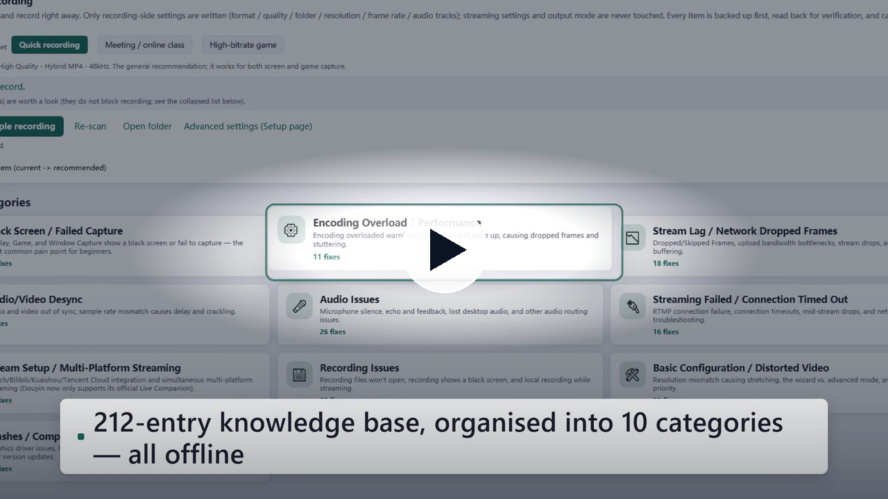

<div align="center">


**当前版本：V3.0.0** —— 数据安全修复 · 无障碍适配 · **Win7 兼容构建支持旧协议 obs-websocket 4.x** ·
回放缓存一键存片 · 日志脱敏与性能优化。详见 [`RELEASE_NOTES_v3.0.0.md`](NOBS/RELEASE_NOTES_v3.0.0.md)。

[](https://github.com/YYRMMAYO/OBS_Helper/actions/workflows/ci.yml)
[]()
[]()
[]()
[](https://github.com/YYRMMAYO/OBS_Helper/releases)
[](https://github.com/obsproject/obs-studio/releases)
[]()
[]()
[]()
[](LICENSE)

[English](README.en.md) · **简体中文**

</div>

**OBS帮助助手**（V2.9.6 前的名字是「OBS 排障助手」，同一个软件、同一条升级链路）是面向直播新手的 OBS Studio 排障工具：**纯离线可用**——212 条问题的知识库、排障指引、日志分析规则全部内嵌在程序里，不联网也能查；连上 OBS 之后还能远程控制场景、录制与推流，并做一键体检。

这是原 Blazor WebAssembly + WebView2 版本的**原生 WPF 重构**（源码在 [`NOBS/`](NOBS/)），功能一比一对齐，但去掉了浏览器内核这一层：冷启动直接起窗口、自包含单目录发布、无需安装 WebView2 与 .NET 运行时。**V2.9.2 起支持中文 / English 即时切换**，**V2.9.3 起连随包离线内容也是中英双份**（知识库 212 条 / 插件目录 57 条 / 场景模板 12 套 / 排障指引全部英译，切语言即时生效）；**V2.2 起内置插件广场**（57 个精选插件 + 本机只读体检，v1.4 目录已全量复核）；**V2.1 起支持增量更新与知识库独立更新**。

> **兼容性**：主构建面向 **Windows 10 / 11**（.NET 10）；另有一套 **Windows 7 SP1 兼容构建**（.NET 6，最后一个支持 Win7 的 .NET 版本），安装包与便携包都在 Release 里，按系统选一个即可。
>
> **OBS 版本适配**：当前对齐 **OBS Studio 32.2.2**（最新稳定版）——日志解析、配置键、obs-websocket 协议与本机插件扫描（含 32.x 新增的「一插件一目录」插件根）均已按真实 32.2.2 环境核对，详见 [V2.9.3 发布说明](NOBS/RELEASE_NOTES_v2.9.3.md)。

---

**目录**：[V3.0.0 亮点](#v300-亮点数据安全--无障碍适配--win7-旧协议兼容--我的模板与我的知识库) · [宣传视频](#宣传视频) · [V2.9.6 亮点](#v296-亮点更名-obs帮助助手--图标统一--文档同步) · [V2.9.5 亮点](#v295-亮点私密反馈通道修正--安全策略中英双语) · [V2.9.4 亮点](#v294-亮点简单录像--帮助与反馈页--仓库封面与社区文件) · [V2.9.3 亮点](#v293-亮点随包内容全量英译--一键部署录制环境--获取与反馈通道扩展--兼容到-windows-7-sp1) · [V2.9.2 亮点](#v292-亮点中英双语与即时切换--安装包语言选择默认中文) · [V2.9.1 亮点](#v291-亮点raw-主通道修复--跳转式引导--官方下载入口) · [亮点](#亮点) · [功能](#功能) · [智能诊断](#智能诊断) · [隐私与安全](#隐私与安全) · [安装与更新](#安装与更新) · [构建](#构建) · [工程结构](#工程结构) · [许可](#许可)

---

## 宣传视频

55 秒看懂 OBS帮助助手能帮你做什么 —— 中英两支都带背景音乐。点封面即看高清成片：

<div align="center">

[](https://github.com/YYRMMAYO/OBS_Helper/releases/download/V2.9.6/nobs-promo-zh.mp4)

▲ **宣传视频 · 中文版**（含背景音乐）：录前自检 · 日志离线分析与掉帧三分类 · 一键部署录制环境 · 插件广场本机体检 · 全局热键与实时监控 —— [观看 / 下载高清版](https://github.com/YYRMMAYO/OBS_Helper/releases/download/V2.9.6/nobs-promo-zh.mp4)（1920×1080 · 30fps · 55s）

<br/><br/>

[](https://github.com/YYRMMAYO/OBS_Helper/releases/download/V2.9.6/nobs-promo-en.mp4)

▲ **Promo video · English**（含背景音乐 / with BGM）：同一支片子的英文版，界面与字幕全英文 —— [Watch / download HD](https://github.com/YYRMMAYO/OBS_Helper/releases/download/V2.9.6/nobs-promo-en.mp4)（1920×1080 · 30fps · 55s）

</div>

---

## V3.0.0 亮点：数据安全 · 无障碍适配 · Win7 旧协议兼容 · 我的模板与我的知识库

> 这是 V3 的第一个正式版，改的是**底子**：让你敢把工作交给它。数据先保住、键盘能全程操作、
> 老机器（Windows 7 + OBS 27）也有一条支线可用；同时补上「把当前场景存成模板」和
> 「自己记一条排障笔记」这两个最常被问到的能力。
> 版本号、安装包、便携包、增量包与仓库标签都对齐到 **3.0.0**。

| | |
|---|---|
| **数据安全（本版主线）** | 所有「写用户文件」的动作走同一条事务通道：**写前快照 + 原子替换 + 校验读回**，中途失败自动回滚；设置、知识库、模板、录制归档都覆盖。路径一律做**越界护栏**（不再能写到目标目录之外）；OBS 密码等机密独立加密存储，不进普通配置 |
| **我的模板（D6 反向捕获）** | 把 OBS 里**当前的场景集合**一键存成模板：场景顺序、来源设置、位置 / 缩放 / 裁剪 / 旋转、滤镜、分组都带上；换机器或重装后一次落地。落地会逐项校验并**如实报告**哪一项没成功，读不到的信息写成显式占位而不是假装成功 |
| **我的知识库（D8）** | 除了内置 212 条，你可以自己写条目（含自建分类），与官方库按 id 合并、本地优先；支持搜索与标签；发现知识库写错或过时可以一键生成回执（Markdown + Issue 模板），正文自动脱敏 |
| **协议层补齐（D7）** | 节目截图存盘、滤镜开关 / 参数、媒体播放控制、音频监听类型、演播室模式切换与转场——主构建走 obs-websocket v5，Win7 兼容构建走 v4.9.1，两套请求名与字段名分别按官方协议对照实现（含 v4 的 60 个请求名全量核对与守卫测试） |
| **Windows 7 兼容构建** | 另有一套 `.NET 6` 构建（安装包 / 便携包 / 增量包同名带 `_win7`）：默认端口 4444、默认启用旧协议，数据目录独立为 `%LocalAppData%\OBS_Helper_Win7`，与主构建互不影响、可各自安全卸载 |
| **无障碍适配** | 连接徽章可 Tab 聚焦并用空格 / 回车激活；设置页 6 个背景色板可键盘选择（此前只能鼠标点）；图标按钮有可访问名称；Toast 主动抛实时区域事件（读屏能被通知）。新增静态检查脚本并接入 CI，承诺与已知限制写在 [`ACCESSIBILITY.md`](ACCESSIBILITY.md) |
| **国际化机制与守卫** | 界面与随包内容中英双语，切换即时生效（含代码拼出来的文案原地重放）；英文内容资产缺失时**界面上会说明哪几块回退成了中文**，不再悄悄显示中文 |
| **质量基线** | **1209 项单元测试全部通过**；无界面自检 **26 项**，主构建与 Win7 兼容构建**各跑一次**；CI 另有 XAML 资源引用、文案键对等、文档一致性、无障碍静态检查、增量包端到端升级（2.9.6 → 3.0.0 全文件 SHA-256 比对）五道门禁。发布前做了**五轮**分视角验证，其中一轮是专查「上一轮修复本身」的交叉审查 |
| **已知边界（如实列出）** | 产物**未做代码签名**（无 Authenticode 证书，SmartScreen 可能提示未知发布者）；无障碍**未经 NVDA / Narrator 实测**；Win7 兼容构建的自检在本机 .NET 6 运行时上跑通，但**未在真实 Windows 7 机器、也未对真实 OBS 27 的 v4 握手验证过**；`.NET 6` 已停止安全更新，它只是「必须跑 Win7」时的退路 |

详见 [RELEASE_NOTES_v3.0.0.md](NOBS/RELEASE_NOTES_v3.0.0.md)（含逐项修复记录与未修项）。

---

## V2.9.6 亮点：更名 OBS帮助助手 · 图标统一 · 文档同步

> 本版**不新增功能**，做的是把「这个软件是谁」讲清楚：**名字、图标、文档**三处对齐。
> 一句话给老用户：**换成新名字，还是原来那个软件** —— 升级路径、数据目录、增量更新全都没动。

| | |
|---|---|
| **更名为「OBS帮助助手」** | 旧名「OBS 排障助手」从此只出现在「曾用名」语境里。窗口标题、托盘与通知、新手引导、诊断报告署名、反馈材料抬头、安装向导的快捷方式 / 卸载项 / 完成页（中英各一套）全部换名；英文界面仍是 `OBS Helper`。**刻意不动的四件事**：`AppId`、`OBS_Helper.exe` 文件名、`%LocalAppData%\OBS_Helper` 数据目录、Release 资产命名 —— 老用户升级后仍装在原目录、设置与密钥不丢、应用内增量更新照旧；只有全新安装才用新目录名 `{autopf}\OBS帮助助手` |
| **应用图标与仓库图标统一** | 此前应用用的是旧版「OBS 圆标 + 齿轮角标」位图，与 README / 仓库头像 / 社交预览上的图标（深色圆角底 + 显示器 + 健康波形 + 录制指示点 + 体检对勾）**不是同一枚**。本版统一为后者，并给 16 / 24 / 32 px **单独重绘**（描边加粗、波形减到一峰、对勾徽章放大并夹在底板内），托盘与任务栏不再糊成一团；生成脚本 `NOBS/scripts/gen_appicon.py` 重写入库（源 = 仓库图标，输出 7 档尺寸），可复现、不依赖任何本机路径 |
| **随包素材与文案同步** | 品牌三图（`icon.svg` / `banner.svg` / `social-preview.svg`）的文字与新名一致，并按原脚本重新渲染 PNG 入库；插件广场里的官方 Dock 插件条目改为「OBS帮助助手（Dock 版）」；AI 系统提示里的角色描述不再与产品名混用 |
| **文档同步** | 根 README / [English README](README.en.md) / NOBS README / [贡献指南](CONTRIBUTING.md) / [安全策略](SECURITY.md) / [行为准则](CODE_OF_CONDUCT.md) / [架构](NOBS/docs/ARCHITECTURE.md) 与代码清单全部对齐到 2.9.6；历史发布说明与审校记录里的**品牌名**一并归一（版本内容与结论不动），旧名只保留在「更名」说明里 —— 否则新用户会以为是两个软件（归档的 `OBS_Helper.Client/` 旧 Blazor 壳保持原样，它是历史版本、已不在发布链路上） |
| **质量基线** | **630 项单元测试全部通过**（上一版 626 项，本版新增 4 项，专钉这次最容易漏的地方：产品名在 csproj / 安装包脚本 / 文案表**三处一致**、文案表里不再出现旧名、版本号在 csproj 与 .iss 之间一致、图标含 Windows Shell 会取的 7 档尺寸且三处引用齐全）；Headless 自检 22 项 PASS |

详见 [RELEASE_NOTES_v2.9.6.md](NOBS/RELEASE_NOTES_v2.9.6.md)。

---

## V2.9.5 亮点：私密反馈通道修正 · 安全策略中英双语

| | |
|---|---|
| **修掉一条走不通的指引** | 社区文件里原先写着「安全问题请私信维护者」—— 但 **GitHub 并没有面向任意用户的私信功能**，这条指引无处可点，用户很可能退回公开 Issue 里贴漏洞细节。现在统一改成：安全漏洞走仓库 **Security → Report a vulnerability** 私密通道，或邮件 **752139192@qq.com**；隐私 / 人身安全 / 行为准则事件走邮件；贡献与发布相关的问题同样可以发邮件 |
| **安全策略改为中英双语** | `SECURITY.md` 现在是中英两个完整版本：支持范围、私密报告方式、报告该包含与**不该包含**什么、我们关注的安全面（本地机密双层加密、日志目录白名单与 `..` 二次校验、出站 https 白名单、拒绝内网 / 回环、日志脱敏、配置写入可回滚）、响应时限与不在范围内的情形 |
| **语言口径写清楚** | 中文、英文、中英双语都可以 —— 贡献指南、行为准则、Issue 表单与 PR 模板都加了同一句话；行为准则的中英两版**都是正式版本**（有出入以中文为准） |
| **应用内也补了安全上报引导** | 反馈卡原先只说「请勿公开披露」，却没说该走哪条私密通道。本版在卡片上直接给出邮箱与私密报告通道（中英双语） |

详见 [RELEASE_NOTES_v2.9.5.md](NOBS/RELEASE_NOTES_v2.9.5.md)。

---

## V2.9.4 亮点：简单录像 · 帮助与反馈页 · 仓库封面与社区文件

> 一句话：V2.9.3 解决的是「配置长什么样」，V2.9.4 解决的是「点一次就能录上，且录的时候心里有数」。

| | |
|---|---|
| **简单录像：三档预设，一个词配好并开录** | 把「配好 → 验好 → 开录」收进首页一张卡。预设只回答「录什么」：**快速录像**（1080p / 60fps，通用推荐）、**会议 / 网课**（30fps，文件小、CPU 友好）、**游戏高码率**（60fps + 自动分段，长录制不产生单个巨型文件）。落到配置上的写项只有「录像格式 / 录像质量 / 音频轨 / 分段」这几类可验证的键——**仍然不碰推流参数、输出模式、编码器族与码率**，那些属于用户自己的选择 |
| **OBS 没启动也能一键进入可录状态** | 录不了的第一大原因是 OBS 根本没开：从注册表 `DisplayIcon` 与常见安装目录解析 `obs64.exe`，拉起后每 1 秒轮询等 obs-websocket 就绪（最长 75 秒），就绪即自动开录。字符串解析与磁盘探测刻意分成两层，**找不到 exe 就不猜路径**，直接提示用户自己启动；文件通道改完还会提示「要重启 OBS 才生效」 |
| **「现在能不能录」只有一行结论** | 不想读六行自检清单的人只看这一行：就绪，或者阻断 + 原因 + 出口。阻断按硬门槛排序（正在推流 → 缺配置 / 文件通道写不了 → OBS 在跑但没连上 → 自检失败项 → 警告项）。原先这两种情形会笼统掉进「OBS 在跑但没连上」，真实原因（**直播中不能改输出参数**）反而看不到 |
| **录制中看得到已录时长与剩余可录** | 「还要多久录满」是录制场景第一大未知：时长优先用 OBS 自报的 timecode（**暂停不计入**），拿不到才退回本地计时；剩余按预设码率 × 1.5 冗余估算，低于 10 分钟提示低空间。首页卡、控制台输出区与托盘 ToolTip 共用同一份状态 |
| **录完找得到** | 停止后读回文件大小（正面回应「录完才发现是空文件」），装了 ffmpeg 可一键无损转封装成 MP4，没有时给 OBS 自带「重新封装录像」的菜单路径，而不是留一个点了报错的按钮 |
| **反馈终于找得到了** | V2.9.3 的反馈卡只埋在「工具箱」与「搭建」页底部——要反馈的人得先猜到它在哪一页，等于没有入口。本版新增**一级导航「帮助与反馈」**：反馈表单 / GitHub Issue / 离线二维码，外加**一键复制报错材料**（版本号 + 系统 + OBS 连接与场景 + 录前自检结论，**不含路径、设备名与日志原文**），并在首页快捷入口与托盘菜单各留一个入口 |
| **仓库封面与社区文件** | 重绘矢量图标（`assets/icon.svg`）与封面（`assets/banner.svg` + 1280×640 社交预览），用脚本渲染成 PNG 一并入库（GitHub 社交预览只吃位图）；补齐 GitHub 社区标准缺的五项：行为准则 / 贡献指南 / 安全策略 / Issue 表单 / PR 模板 |
| **质量基线** | **626 项单元测试全部通过**（上一版 565 项，本版新增 61 项）。新增部分钉的是「编译器看不见」的错法：预设只写录制侧参数、三档预设的分段差异、就绪判定的优先级与三种阻断原因互不相同、`DisplayIcon` 的四种真实形态（含目录名里带逗号）、剩余可录的边界（0 码率不除零 / 负数归零 / 10 分钟阈值）。三轮分视角审校见 [审校记录](NOBS/docs/reviews/REVIEW_2026-10-05-v2.9.4.md) |

> **已知边界（如实说明）**：简单录像的预设取值与「拉起 OBS → 自动开录」这条链路**没有对真实 OBS 做过端到端验证**，
> 只做到协议 / 键名 / 纯逻辑单测级别；剩余可录是**估算**而非实测写入速率；便携版与绿色解压版 OBS 的安装路径识别能力有限，
> 找不到时会明确提示用户自己启动，而不是猜一个路径。

详见 [RELEASE_NOTES_v2.9.4.md](NOBS/RELEASE_NOTES_v2.9.4.md)。

---

## V2.9.3 亮点：随包内容全量英译 · 一键部署录制环境 · 获取与反馈通道扩展 · 兼容到 Windows 7 SP1

| | |
|---|---|
| **随包离线内容全量英译** | V2.9.2 把界面与代码内文案做成了中英双语，但**数据资产只有中文**——英文界面下知识库、插件广场、场景模板、排障指引仍显示中文。本版补齐：知识库 **212 条 / 5.77 万汉字**、插件目录 **57 条**、场景模板 **12 套（323 处可译叶子）**、排障指引**全文**，全部有英文并列文件（`problems.en-US.json` 等）。**中文文件名刻意保持不变**——raw 热更新地址、Release 资产名、用户本机已下载的缓存都依赖它，改名就是静默回归 |
| **只译展示文案，不译逻辑键** | `id` / `category` / `related` / `platforms` / `links[].url` / `repo` / `dlls` / `inputKind` / `transform` 与 `settings` 里的数值一律逐字照抄；`severity` / `level` / 插件角标这类**跨语言展示值用固定映射**（`常见→Common`、`进阶→Advanced`、`热门→Popular`…）并与 `Localization/DataValues` 认识的取值一一对应，否则卡片配色与排序会静默退化。**场景 / 来源名会被写进 OBS**，同一中文名必须译成同一英文名且不同名不撞名——这是唯一会导致「功能坏了」的翻译错误（shared 来源靠名字跨场景复用，撞名会重复创建设备），有专门单测 |
| **内容按语言装载，回退必须写日志** | 新增 `Localization/ContentAssets` 统一入口，解析次序固定为「当前语言的外部缓存 → 当前语言的随包内嵌 → **中文随包内嵌**」，最后一级兜底**必写 WARN**。这条是刻意设计：否则英文用户会「安静地看到中文内容」——正是 V2.9.1 修 raw 404 时踩过的坑（静默失败能潜伏很久）。语言切换时丢弃按语言缓存（挂在语言服务事件上），因此切语言是即时的 |
| **热更新两条通道按语言分发** | raw 主通道新增英文地址；**Release 资产匹配器按语言严格区分**——中英资产挂在同一个 Release 上，原来的「前缀 + `.json` 后缀」匹配会把两份都认下来，中英用户互相拿到对方的文件（而且内容合法、解析成功，**完全静默**）；本地缓存与节流状态也按语言分文件，切语言后补刷当前语言那一份。`build.ps1` 现在导出中英四份资产，兜底通道才真正对英文用户可用 |
| **一键部署录制环境** | 装好 OBS 之后最实际的一步：按「录制向」逐项列出现状与建议（录像格式 → Hybrid MP4、录像质量 → HQ、录像目录、画布/输出 → 1920x1080、帧率 → 60、音频采样率 → 48kHz），**全部先自动备份、可一键回滚、每项可单独取消**。两条落地通道自动选择：连上 OBS 走 obs-websocket（即时生效、无需重启）；OBS 已退出则改当前配置集的 `basic.ini`（写盘前备份、**写盘后重新读回逐项校验**）。明确不碰推流参数与输出模式——那些属于用户自己的选择 |
| **获取 OBS 的通道扩展** | 原有三条官方入口之上新增：**应用内下载官方安装包**（解析当前稳定版直链 → 再校验一次官方域名 → 带百分比进度流式下载 → 下完一键启动安装向导，**不静默安装**，UAC 与安装路径始终由你决定）；**瓦特工具箱（原 Steam++）** 给 GitHub 加速；**微软商店**的 OBS Studio（商店版更新略慢于官网，文案已如实标注；低于 Win10 1809 时入口直接隐藏）。备用通道与官方源**分开判定白名单**，否则「只从官方渠道下载」这句防伪提示就失真了 |
| **BUG 反馈：表单 + 二维码** | 腾讯文档表单 + GitHub Issues 两个出口，出站前都过白名单（同前缀仿冒域拒绝）；**二维码随包内嵌、离线可扫**，生成脚本用两个互不相关的实现交叉核对、再用独立解码器把 PNG 读回来断言内容与地址逐字符一致；二维码内容与按钮地址由单测钉成同一个常量，防止二者漂移（扫码用户被送到另一个页面是**没有任何提示**的） |
| **兼容到 Windows 7 SP1（双目标构建）** | .NET 10 最低只支持 Windows 10，而 **.NET 6 是最后一个官方支持 Win7 SP1 的版本**：本版改成双目标并存、同一份源码编两遍——主构建 `net10.0-windows`（安装包 MinVersion `10.0`）与兼容构建 `net6.0-windows`（MinVersion `6.1sp1`，产物带 `_win7` 后缀）。两者共用同一个 AppId，Inno 才会把「换构建」识别成升级而不是并存装两份。兼容层只做**语义完全等价**的替换（`required` 成员 polyfill、`char.IsAsciiDigit` 等价实现、`AesGcm` 新旧构造函数、文件夹选择对话框），不为迁就老框架降低功能 |
| **质量基线** | **565 项单元测试全部通过**（上一版 441 项）。新增部分专盯「编译器看不见」的错法：中英形状逐条对等、英文侧无残留汉字与全角标点、展示值落在 `DataValues` 取值内、场景来源名一致且不撞名、指引标题层级与链接 URL 一一对应、资产按语言的解析与回退次序、Release 资产匹配不串语言、INI 打补丁的保真性与读回校验、Windows 版本判据每一档、下载与反馈入口白名单、`AesGcm` 兼容实现与原构造函数的**密文对拍**。三轮分视角审校，**如实标注了哪些结论有机器证据、哪些只是人工核对**（见 [审校记录](NOBS/docs/reviews/REVIEW_2026-10-05-v2.9.3.md)） |

> **已知边界（如实说明）**：① Windows 7 **真机未验证**——只做到「目标框架可编译 + 安装包 MinVersion 正确下发」；
> ② 英译**没有对着英文版 OBS 逐条核对菜单路径的逐字一致性**，也未经母语者校订；
> ③ 一键部署的两条通道按协议/键名实现并有单测，但**没有对真实 OBS 跑过一次端到端落地**；
> ④ 兼容构建用的 .NET 6 已停止安全更新，它是「必须跑 Win7」时的退路，新机器请用主构建。

详见 [RELEASE_NOTES_v2.9.3.md](NOBS/RELEASE_NOTES_v2.9.3.md)。

---

## V2.9.2 亮点：中英双语与即时切换 · 安装包语言选择（默认中文）

- **中文 / English 即时切换（默认中文）**：界面、托盘菜单与通知、报错提示、日志分析规则与结论、
  各类体检结论、诊断报告与导出内容全部双语，**截至 V3.0.0 为 2239 条**文案键，切换与换主题一样即时生效、不用重启。
- **安装包语言选择页（默认中文）**：向导提供简体中文与英文，**默认中文且不跟随系统语言探测**；
  选定结果写进安装目录下的 `language.ini` 作为首启默认值，判定次序是「应用内选过 > 安装向导选过 > 中文」，
  重装 / 升级不会覆盖用户的选择。
- **数据驱动的展示值两种语言都认**：新增 `Localization/DataValues` 做跨语言判定，
  避免中英切换后卡片的风险色塌成默认值。
- **自检 + 单测补齐「静默错法」**：自检新增「文案资源解析」与「语言切换往返」两项；单测 381 → 441 项。

详见 [RELEASE_NOTES_v2.9.2.md](NOBS/RELEASE_NOTES_v2.9.2.md)。

---

## V2.9.1 亮点：raw 主通道修复 · 跳转式引导 · 官方下载入口

| | |
|---|---|
| **修好知识库主通道（既有缺陷）** | 知识库/插件目录的更新一直是双通道，但**主通道（GitHub raw）的地址少了仓库里的 `NOBS/` 一层，实测恒 404**——也就是说「改一行 JSON 提交即全网生效」从来没生效过，每次都在静默失败后落到 Release 资产兜底。本版改正地址，并把「raw 返回非 2xx / 空内容」「兜底不可用」全部写进日志（原来 404 是静默的，这才是它能潜伏这么久的直接原因），另加**用本机源码树校验路径真实存在**的单测防回归。Release 资产兜底保持不变 |
| **新手引导升级为「跳转式引导」** | 每一步**自动把界面切到对应页面**（控制台 / 首页 / 诊断 / 搭建），同时把卡片挪到右下角、遮罩压到 ≈17% 黑 —— 页面看得见，讲的就是屏幕上正在显示的东西。卡片给出「本步对应页面」+ 站内跳转按钮（搜索 / 助手 / 日志分析 / 工具箱 / 模板 / 插件 / 监控 / 设置），站外按钮标 `↗`；引导结束清空返回历史，上手第一下点「返回」不会退回被介绍过的页面 |
| **官方 OBS 下载入口（防仿冒包）** | 「获取不到官方 OBS」的人有救：搭建页顶部、工具箱、首页欢迎卡、引导第一步、排障指引第 1 条都提供 **官网下载页（中文）** 与 **GitHub 官方发布页**，以及「下载最新 Windows 安装包」（经 GitHub API 解析当前稳定版的**官方直链**，不写死版本号）。所有外链强制 https 且必须在 `obsproject.com`（含官方 CDN 子域）或 `github.com/obsproject/obs-studio` 之下，响应被篡改时宁可退化到发布页也不跳第三方；界面同时给出可自行核对的判据（免费开源、无需注册付费、签名 `OBS Project Corporation`），专治「下载站」「银狐」类仿冒包 |
| **跳转契约可测试** | 路由名常量表拆到 `Navigation/Routes.cs`（纯常量、零 WPF 依赖），引导的「路由必须已注册」「每步互不重复」「站内按钮不指向本步已打开的页面」「站外必须是官方域名」全部有单测；Headless 自检也逐步真实导航并校验页面名与按钮数量 |

详见 [RELEASE_NOTES_v2.9.1.md](NOBS/RELEASE_NOTES_v2.9.1.md)。

---

## 亮点

| | |
|---|---|
| **中文 / English 双语，可即时切换** | 界面、托盘、通知、报错提示、日志规则与体检结论全部双语，**默认中文**，在「设置 → 语言」里一点即换、不用重启；安装时会先问一次语言，作为首次启动的默认值。**V2.9.3 起随包离线内容（知识库 / 模板 / 插件目录 / 排障指引）也是中英双份**，切语言即时生效 |
| **212 条问题库，完全离线** | 内置 **212 条问题**（知识库 v2.2，首页按 10 个分类组织），含现象 / 成因 / 分步解决 / 小贴士 / 相关问题；步骤可勾选，进度自动记住。**知识库支持独立更新**（应用之外随拉随新，不用等发版），中英各一条通道 |
| **插件广场 + 本机体检** | 收录 **57 个精选插件**（8 大分类，v1.4 目录已全量复核：仓库是否归档 / 最近提交与发行 / 有无 Windows 成品包），卡片上标注**维护状态**并直达 GitHub Releases 下载；**只读扫描本机已装插件**——全盘定位 OBS 安装目录（注册表多视图 / 全盘驱动器布局 / Steam 多库）并覆盖 OBS 32.x 的「一插件一目录」插件根，装在非 C 盘也不漏扫；日志分析发现可疑模块可一键跳转对应插件；已知风险插件自动黄标提示 |
| **增量更新，更新更轻** | V2.1 起应用内「增量更新」只下载变更文件（相邻版本增量包通常只有几 MB）；逐文件 SHA-256 校验，失败自动回退完整安装包；安装版自动提权替换并重启 |
| **安装包自动清理** | 启动后自动扫描临时 / 下载 / 桌面目录，删除本应用旧安装包与增量包（每类保留最新一份），只认 `OBS_Helper_*` 命名，不碰其它文件 |
| **免费 AI 诊断，开箱即用** | 不用注册、不用 API Key。内置两条免费通道（智谱国内直连 / Pollinations 全球免 Key），**本地强制限频**保护免费服务，失败自动回退离线引擎 |
| **远程控制 OBS** | 场景切换、元素显隐、音频静音与音量、录制 / 推流 / 虚拟摄像头、定时停止、打开录制目录——控制台、托盘、全局热键、迷你小窗四种入口随时可用 |
| **全局热键** | `Ctrl+Alt+R` 录制 · `Ctrl+Alt+S` 推流 · `Ctrl+Alt+C` 虚拟摄像头 · `Ctrl+Alt+M` 小窗 · `Ctrl+Alt+O` 显隐窗口——全部可在设置里改键或停用 |
| **深度日志分析** | 离线解析 OBS 日志：**39 条规则 + 3 项量化比值**（已按 OBS 32.2.2 真实日志核对解析）；日志在分析前**先脱敏**；掉帧 / 崩溃线索可关联到嫌疑插件并直达插件广场 |
| **场景模板一键落地** | 6 套内置直播间模板（游戏 / 竖屏带货 / 双人连麦 / 教学 / 电台待机 / 开播三件套），连上 OBS 一键生成场景与来源（含过渡设置）；模板会标注推荐插件并对照本机体检提示缺失 |
| **隐私优先** | 偏好文件不含任何凭据；密码与 API Key **双层加密**（AES-256-GCM + DPAPI）。只有你主动发起诊断才会联网，请求前先脱敏；本机插件体检全程只读、结果仅存本机 |
| **一键部署录制环境** | 装好 OBS 后一条龙：逐项列出「录制向」推荐值（录像格式 / 质量 / 目录 / 画布分辨率 / 帧率 / 采样率）与当前值对照，勾选后**先自动备份**再落地，可一键回滚；连上 OBS 走 obs-websocket 即时生效，OBS 已退出则改 `basic.ini`（写盘后读回校验） |
| **简单录像（一键开录）** | 首页一张卡：「快速录像 / 会议网课 / 游戏高码率」三档预设选一个，点一次就完成自检 → 备份 → 落地 → （OBS 没开就拉起并等就绪）→ 开始录制；录制中显示已录时长与剩余可录，停止后提示文件并可一键打开目录 / 转 MP4 |
| **零第三方依赖** | 原生 WPF + .NET 10（另有一套 .NET 6 的 Win7 兼容构建），无 NuGet 包、无 WebView2，`obs-websocket` 协议纯手写；文案表也是纯 BCL 的 C# 字典（零依赖双语）；自包含单目录，秒开 |

## 功能

### 学习与排查

- **新手教程** — 首次启动的四步分步引导（连上 OBS → 出问题先查这里 → 一键体检 → 开播与装修），讲到的入口都是真实导航名；`设置 → 新手引导` 可随时重看，无需重启
- **知识库** — 212 条问题（知识库 v2.2，首页按 10 个分类组织），含现象 / 成因 / 分步解决 / 小贴士 / 相关问题；步骤可勾选且进度会记住
- **知识库独立更新** — 问题库 / 插件目录与应用版本解耦：启动静默自动更新（6 小时节流）/ 设置页「检查知识库更新」/ 更新弹窗「仅更新知识库」三入口；GitHub raw 主通道 + Release 资产兜底
- **搜索** — 边打边搜，跨标题、现象、成因匹配
- **问我一下** — 用大白话描述现象，自动匹配最可能的问题
- **排障指引** — 通用排查思路速查手册

### 插件广场

- **精选插件目录** — 8 大分类 × 57 个精选插件（自动化 / 视觉特效 / AI 智能 / 音频 / 多平台竖屏 / 录制后期 / 输入互动），目录外置热更新，链接纠错与新插件上架无需发版；**v1.4 目录已按「仓库未归档 + 近 12 个月有动静 + 有 Windows 成品包」全量复核**，卡片标注维护状态（放缓的会明示理由）
- **本机插件体检（只读）** — 扫描已装 DLL 与版本，标注「广场收录 / 未收录」；OBS 安装目录多信号全盘定位：进程 → 注册表（HKLM 双视图 + HKCU + DisplayIcon 反推）→ 全盘固定驱动器常见布局 → Steam 多库解析，兼容便携版、用户级插件目录与手动指定目录
- **直达下载** — 每张卡片直达 GitHub Releases 最新版，带「最新 vX.Y.Z」角标；可「关注」插件，启动时静默查新（仅 Toast）
- **日志 × 插件联动** — 日志分析提取加载失败 / 崩溃肇事模块，能对上广场条目时一键跳转；AI 类插件标注公开开销并联动系统监控给性能预算提示

### 智能诊断

- **智能诊断** — 连上 OBS 后一键体检；三种引擎可选（见下方 [智能诊断](#-智能诊断)），**结果可导出为 Markdown 报告**
- **日志分析** — 离线解析 OBS 日志：39 条规则 + 3 项量化比值；分析前先脱敏

### 控制 OBS

- **OBS 控制台** — 场景切换、元素显隐、音频静音与音量、录制 / 推流 / 虚拟摄像头、实时统计、**定时停止录制/推流**、**一键打开录制目录**
- **系统托盘 + 通知** — 关闭窗口最小化到托盘，托盘菜单直接控制录制 / 推流 / 虚拟摄像头；录制 / 推流状态变化弹系统通知（可关）
- **迷你小窗** — 置顶小窗一键开始 / 停止录制与推流（含虚拟摄像头），可拖拽、记住位置；托盘菜单、控制台页按钮或全局热键随时呼出
- **全局热键** — 系统级快捷键（默认 `Ctrl+Alt+R/S/C/M/O`），全部可在设置页改键或停用
- **场景自动切换** — 按前台窗口标题自动切换场景，支持关键词 / 正则规则，规则表在设置页管理

### 保持健康 & 快速开播

- **系统监控** — CPU / 内存 / 网络上下行 / 磁盘空间实时曲线（近 2 分钟），与 OBS 渲染帧率、丢帧数据联动，磁盘空间不足时预警
- **场景模板** — 6 套内置直播间模板，连上 OBS 一键落地场景与来源（自动设置过渡与时长）；未连接时可导出为标准场景集合 JSON
- **OBS 配置管理** — 配置目录检测、备份 / 导出（ZIP，默认脱敏不含推流密钥）、导入（覆盖 / 合并，自动预备份）、轻度重置与彻底重置
- **直播搭建** — 从零到开播的 6 步流程 + 10 个主流平台的推流配置
- **外观** — 浅色 / 深色 / 跟随系统，4 档字号，高对比与减少动画
- **语言** — 简体中文 / English 即时切换（默认中文，无需重启）；安装向导里选定的语言是首次启动的默认值。**界面与随包内容（知识库 / 模板 / 插件目录 / 指引）同步跟随**
- **一键部署录制环境** — 搭建页的录制环境卡：逐项列出推荐值与当前值，勾选后先备份再落地，可一键回滚
- **简单录像** — 首页的简单录像卡：三档预设一键配好并开录，OBS 没启动时会先拉起并等就绪；录制中显示已录时长与剩余可录；停止后可打开目录或一键转 MP4
- **获取 OBS** — 官方三条入口 + 应用内下载官方安装包（带进度、可启动安装向导）+ 瓦特工具箱 / 微软商店两条备选通道
- **帮助与反馈** — 一级导航直达：表单二维码随包离线可扫、GitHub Issue 入口，**安全上报引导**（邮件 / 仓库 Security 私密通道），以及**一键复制报错材料**（版本与检测结论，不含路径与日志原文）

## 智能诊断

连上 OBS 后一键体检，三种引擎可选：

| 引擎 | 原理 | 成本 |
| --- | --- | --- |
| **本地规则引擎**（默认） | 确定性离线规则匹配，与日志分析同源 | 免费、纯离线 |
| **免费 AI（内置）** | 两条通道——**智谱免费模型**（国内直连最稳，密钥构建时加密内嵌）与 **Pollinations**（国外免 Key 公共通道）。本地限频：智谱 **10 次/天**、Pollinations **20 次/天**，独立计数、互不挤占，每天 0 点恢复 | 免费、免注册 |
| **云端大模型** | OpenAI 兼容接口 + function calling，接入你自己的 API Key（双层加密保存在本机） | 你的 API 费用 |

云端 / 免费失败时**自动回退本地引擎**，并在结果中说明原因。免费档为单轮普通对话（不做知识库工具调用）；需要多轮深度排查或更高频使用，请接入你自己的云端 API。

## 隐私与安全

所有数据只存在本机：

- **偏好**（外观、语言、收藏、步骤进度、连接设置、热键键位、自动切换规则、托盘行为）→ `%LocalAppData%\OBS_Helper\prefs.json`——明文 JSON，**均不含任何凭据**
- **OBS 密码与 AI API Key** → `%LocalAppData%\OBS_Helper\secrets.dat`——**双层加密**：值先经 AES-256-GCM（密钥由本机 `MachineGuid` 经 PBKDF2-SHA256 派生）加密，整个文件再经 DPAPI（绑定当前 Windows 用户 + 应用熵）加密；换机 / 换用户无法解开，即使文件被离线窃取也无法还原

**发现了安全漏洞？** 请勿在公开 Issue 里披露细节 —— 走仓库 **Security → Report a vulnerability** 私密通道，或发邮件到 **752139192@qq.com**（标题加 `[SECURITY]`）。完整策略见 [SECURITY.md](SECURITY.md)（中英双语）。中文或英文都可以。

只有在你**主动开启**「免费 AI」或「云端诊断引擎」并发起诊断时才会联网，且请求前会先对日志脱敏。OBS 配置备份 / 导出默认不含推流密钥（可勾选包含），密码与 Token 自动脱敏。

## 安装与更新

- **GitHub Releases** — 从 [Releases 页面](https://github.com/YYRMMAYO/OBS_Helper/releases) 下载安装包或便携版；便携版免安装、自带 .NET 运行时。**安装向导会先让你选语言**（简体中文 / English），默认中文，选定结果作为应用首次启动的默认语言
  - `OBS_Helper_Setup_2.9.6.exe` / `OBS_Helper_Portable_2.9.6.zip` — **主构建**，面向 **Windows 10 / 11**
  - `OBS_Helper_Setup_2.9.6_win7.exe` / `OBS_Helper_Portable_2.9.6_win7.zip` — **Win7 兼容构建**，面向 **Windows 7 SP1 及以上**（.NET 6，已停止安全更新；新机器请用主构建）
  - 两个构建共用同一个 AppId，从兼容构建换到主构建会被识别成升级而不是装两份
- **蓝奏云（国内镜像）** — 提取码 `YYKWY`（详见应用内更新弹窗）
- **应用内更新（推荐）** — 「检查更新」对比 GitHub 最新版本后，可任选：
  - **增量更新全部功能**：只下载自上一版本以来的变更文件（通常几 MB），下载后自动校验、提权替换并重启
  - **仅更新知识库**：单独升级问题库，几秒完成，不用重装应用
  - **完整安装包**：蓝奏云 / 应用内下载整包覆盖安装

> **主构建**支持 Windows 10 / 11；**兼容构建**支持 Windows 7 SP1 及以上。均无需 WebView2、无需另装 .NET 运行时。
> 已装 2.9.5 的用户可直接走应用内「增量更新」升到 2.9.6；**本版只是更名，`AppId` / 安装目录 / 数据目录
> 都没变**，所以增量升级与覆盖安装都照旧。停留在 2.1.x ~ 2.9.4 的用户增量包基准对不上，
> 用安装包或便携包覆盖升级即可。
> **语言与升级**：安装时选的语言只决定首次启动的默认值；之后在应用内改过语言，重装 / 升级都不会覆盖你的选择。
> 还没装 OBS？应用内「搭建」页 / 「工具箱」/ 首页欢迎卡都提供**官方**下载入口
> （`obsproject.com` 与 GitHub 官方发布页），也可以直接在应用内下载官方安装包；
> GitHub 拉不动时可先用瓦特工具箱（原 Steam++）加速，或改用微软商店的 OBS。
> 遇到问题？左侧导航的 **「帮助与反馈」** 页有反馈表单（手机扫码即可填）、GitHub Issue 入口、
> 安全上报引导，以及「一键复制报错材料」；首页快捷入口与托盘菜单也各有一个入口。
> **安全问题请勿公开披露** —— 走仓库 **Security → Report a vulnerability**，或邮件 **752139192@qq.com**。

## 构建

需要 [.NET 10 SDK](https://dotnet.microsoft.com/download)（构建 Win7 兼容目标时会自动拉取 .NET 6 的参考包）；
打安装包还需要 [Inno Setup 6](https://jrsoftware.org/isdl.php)。

```powershell
# 在仓库根目录
cd NOBS

# 跑起来看看
dotnet run --project OBS_Helper.Wpf

# 双目标：主构建 + Win7 兼容构建 -> 安装包 / 便携 zip / 增量包 / 知识库资产
.\build.ps1

# 只出主构建（快速迭代时）
.\build.ps1 -SkipLegacy

# 额外出一个单文件 exe（主构建）
.\build.ps1 -SingleFile

# 没装 Inno Setup 时只出便携包
.\build.ps1 -SkipInstaller

# 跳版本发布：指定增量包基准（让停留在更早版本的用户也能直接增量升级）
.\build.ps1 -DeltaBaseVersion 2.0.0

# 发布后校验增量包可完整升级（模拟升级 + 全文件 SHA-256 比对）
python scripts\verify_delta.py --old PAKE\windows\OBS_Helper_Portable_2.9.5.zip --delta PAKE\windows\OBS_Helper_Update_2.9.6.zip --publish OBS_Helper.Wpf\bin\Release\net10.0-windows\win-x64\publish

# 全量单测（含中英内容对等 / 资产按语言装载 / INI 打补丁 / 版本判据等）
dotnet test OBS_Helper.Wpf.Tests\OBS_Helper.Wpf.Tests.csproj -c Release
```

产物落在 `NOBS\PAKE\windows\`：

- `OBS_Helper_Setup_2.9.6.exe` — 安装包（主构建，MinVersion 10.0，向导含语言选择页）
- `OBS_Helper_Setup_2.9.6_win7.exe` — 安装包（Win7 兼容构建，MinVersion 6.1sp1）
- `OBS_Helper_Portable_2.9.6.zip` / `…_win7.zip` — 解压即用
- `OBS_Helper_Update_2.9.6.zip` — 增量更新包（含 `update_manifest.json`，应用内增量更新用）
- `OBS_Helper_Portable_2.9.6.exe` — 单文件（需 `-SingleFile`）
- `OBS_Helper_Knowledge_2.9.6.json` / `…2.9.6.en-US.json` — 问题库热更新资产（中英各一份）
- `OBS_Helper_Plugins_2.9.6.json` / `…2.9.6.en-US.json` — 插件广场目录热更新资产（中英各一份）
- `manifests/manifest_<ver>.json` — 各版本完整文件清单（SHA-256，增量包 diff 基准；不随 Release 发布）

## 工程结构

```
NOBS/
  OBS_Helper.Wpf/
    App.xaml(.cs)          应用入口、全局异常 -> 报错码弹窗
    MainWindow.xaml(.cs)   左侧导航 + 顶栏 + 页面容器 + 新手引导覆盖层，路由注册在这里
    AppServices.cs         组合根：所有服务的惰性单例，手工装配
    Navigation/            极简路由（路由名 -> 页面工厂，带缓存与后退栈）
    Localization/          文案表（中 / 英两份，纯 BCL 零 WPF 依赖）
                           + DataValues（跨语言展示值判定）
                           + ContentAssets（随包内容按语言装载 + 回退标记）
    Compat/                Windows 7 兼容构建（net6.0-windows）所需的编译期 polyfill
    Views/                 18 个页面 / 窗口
    Controls/              共享控件与值转换器（含下载卡 / 反馈卡 / 一键部署录制环境卡）
    Themes/                Palette.xaml 调色板 + Controls.xaml 样式库
    Models/                知识库、obs-websocket 协议、OBS 配置模型
    Services/
      Compat/              FolderPicker（net6/net8 两条分支）等跨 TFM 等价实现
      Host/                HostBridge（DPAPI、日志读取、AI 转发）、LocalStore
      Obs/                 WebSocket 客户端、连接服务、日志分析、脱敏
      ObsConfig/           OBS 配置定位、备份/导出/导入、重置、场景模板落地、
                           RecordingEnvCore/Service（一键部署录制环境：推荐项 + INI 打补丁）
      Plugins/             插件广场：目录数据 / 本机体检扫描（含 OBS 32.x 插件根）/ Releases 查新 / 关注提醒
      Update/              增量更新、知识库独立更新（按语言分发）、安装包自动清理、
                           ObsDownloadLinks / FeedbackLinks（出站白名单常量）
      Ai/                  本地 / 免费 / 云端诊断引擎与编排（含免费档本地限频器）
      Shell/               系统托盘、全局热键、场景自动切换、定时器、系统监控、录制守护、日志尾随、新手引导
      Markdown/            排障指引的 Markdown 解析
      OsSupport.cs         Windows 版本判据（决定商店入口等能力的显隐）
      LocalizationService.cs  语言服务：偏好持久化、写入 Application.Resources、广播语言切换
    Assets/                problems[.en-US].json / plugins[.en-US].json / scene_templates[.en-US].json /
                           troubleshooting[.en-US].md（中英并列，内嵌种子）、feedback_qr.png、图标
  OBS_Helper.Wpf/OBS_Helper_Setup.iss  Inno Setup 脚本（按 TFM 传 MinVersion / 输出名，UTF-8 带 BOM）
  OBS_Helper.Wpf.Tests/    1209 项单测（直接链接纯逻辑源文件，不引用整个 WPF 工程）
  build.ps1                Windows 构建与打包脚本（双目标：安装包 / 便携 / 增量包 / 清单 / 内容资产）
  scripts/verify_delta.py  增量包发布校验工具（模拟升级 + 全文件 SHA-256 比对）
```

换肤与换语言走的是同一条路：**把当前主题的调色板 / 当前语言的文案整体写进 `Application.Resources`**，
XAML 一律用 `DynamicResource`（主题键直接用、文案键写作 `Loc.<键>`）引用，
所以两者都是整窗即时生效的，不需要重建窗口或重启。
代码里拼出来的文案由 `LocalizationService` 广播事件、主窗口把当前页面原地重放一次刷新。

### 仓库结构

| 目录 | 说明 |
| --- | --- |
| `NOBS/` | **当前维护中的 Windows 原生 WPF 版**（本文档介绍的就是它） |
| `OBS_Helper.Client/` | 旧版共享前端（Blazor WASM），仅存档 |
| `OBS_Helper.Mac/` | macOS 桌面壳（Tauri v2），仅存档 |

## 许可

MIT，见 [LICENSE](LICENSE)。